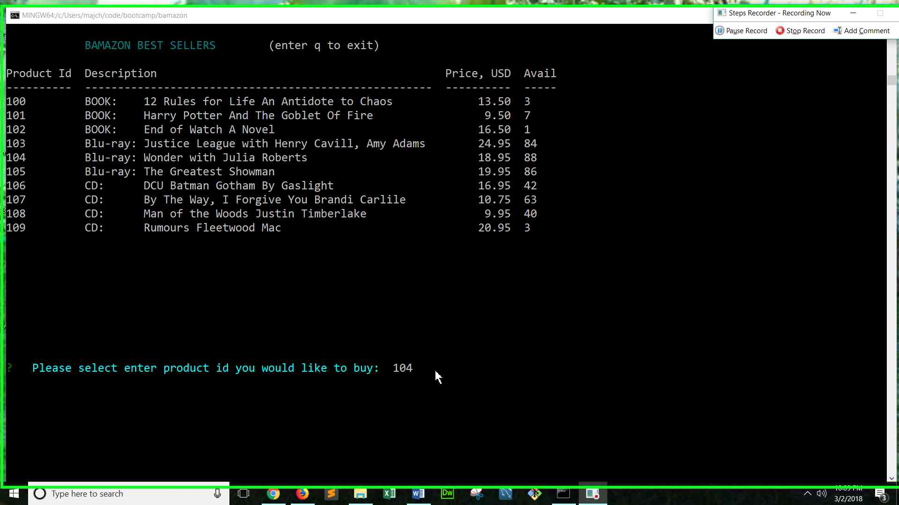
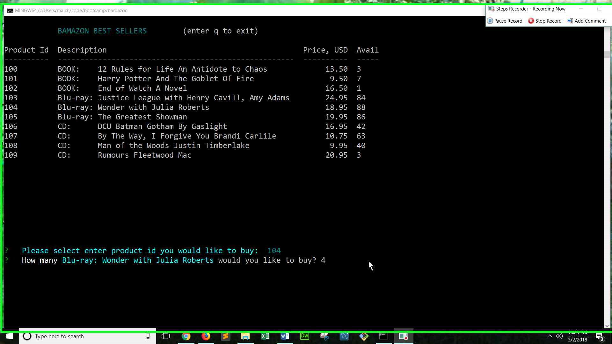
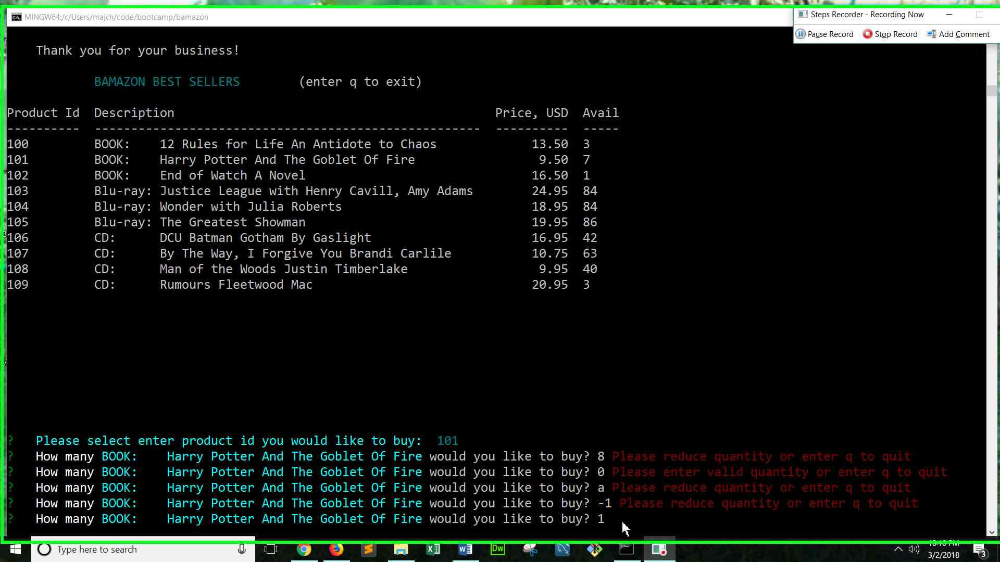
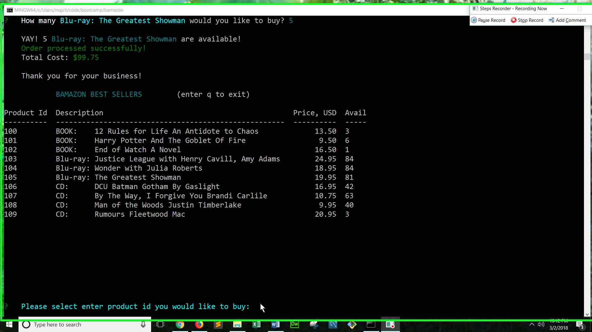
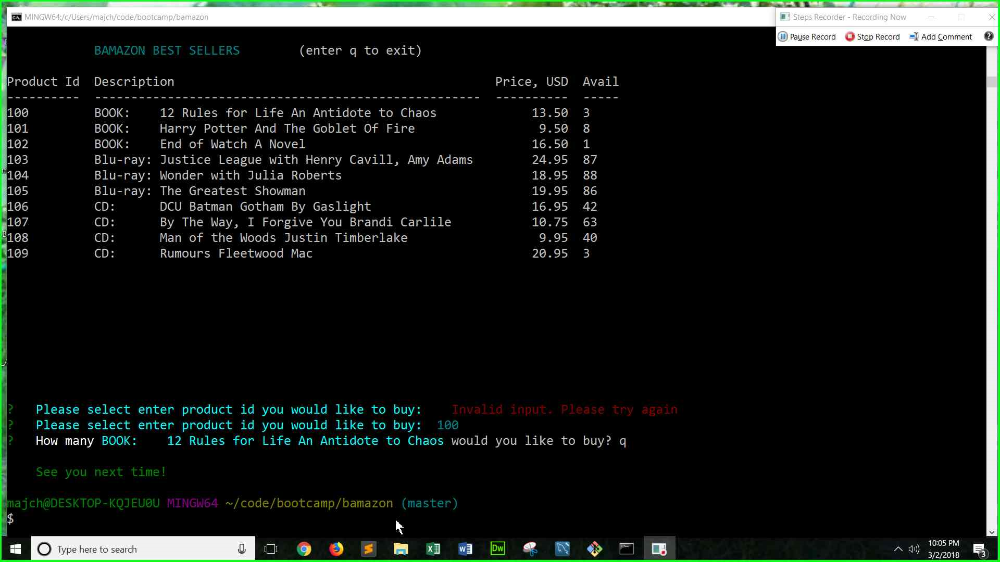

# bamazon
Amazon-like storefront 

Amazon-like storefront using node, and MySQL. The app will take in orders from customers and deplete stock from the store's inventory.
It uses inquirer, mysql, and easy-table npm packages.

To view a video of the app:
https://youtu.be/R6TUbIDd-aM 

To start bamazonCustomer.js app:

Type:
#### node bamazonCustomer

##### After the app starts, it asks for the product id of the item the user would like to purchase. After any invalid input a red error message will be shown and the user is prompted to reenter the product id.

##### Below is a sample screen

### sample text screen

   ##     BAMAZON BEST SELLERS        (enter q to exit)

#### Product Id  Description                                            Price, USD  Avail
----------  -----------------------------------------------------  ----------  -----
* 100         BOOK:    12 Rules for Life An Antidote to Chaos             13.50  3
* 101         BOOK:    Harry Potter And The Goblet Of Fire                 9.50  6
* 102         BOOK:    End of Watch A Novel                               16.50  1
* 103         Blu-ray: Justice League with Henry Cavill, Amy Adams        24.95  84
* 104         Blu-ray: Wonder with Julia Roberts                          18.95  84
* 105         Blu-ray: The Greatest Showman                               19.95  76
* 106         CD:      DCU Batman Gotham By Gaslight                      16.95  42
* 107         CD:      By The Way, I Forgive You Brandi Carlile           10.75  63
* 108         CD:      Man of the Woods Justin Timberlake                  9.95  40
* 109         CD:      Rumours Fleetwood Mac                              20.95  3

* ?   Please select enter product id you would like to buy: 

* ?   Please select enter product id you would like to buy:    **Invalid input. Please try again**
* ?   Please select enter product id you would like to buy:  **0  Invalid input. Please try again**
* ?   Please select enter product id you would like to buy:  **111  Invalid id. Please try again**
* ?   Please select enter product id you would like to buy:  **103**

##### Next the app will ask how many of the item the user would like to purchase. 
##### If that quantity is available. It will remove those from inventory and print out the total sale.

*   How many Blu-ray: Justice League with Henry Cavill, Amy Adams would you like to buy? **3**
*     YAY! 3 Blu-ray: Justice League with Henry Cavill, Amy Adams are available!
*     Order processed successfully!
*     Total Cost: $74.85
*     Thank you for your business!

##### Invalid input messages for the quantity input will be in red text. The app will then aak the user to input again.

##### After the order, the bamazon inventory list will return and ask for another order.

##### The user can exit any time by entering q in either the product id input or the quantity input. 

#### Note: to setup to use the bamazonCustomer app
 * use bamazon.sql to create the bamazon mysql database and insert test data.
 * npm install

